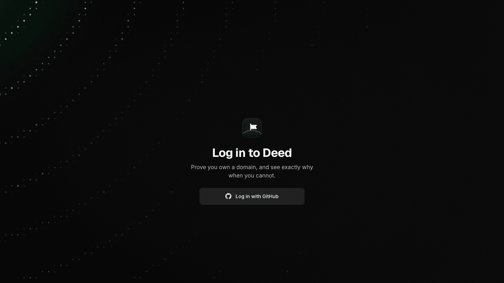
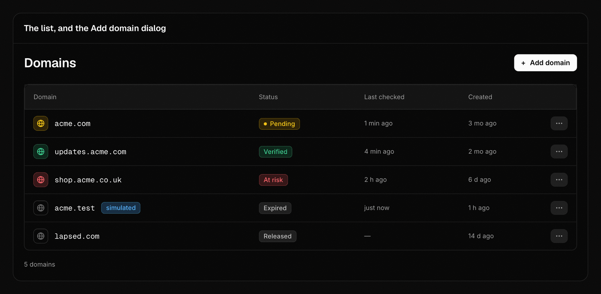
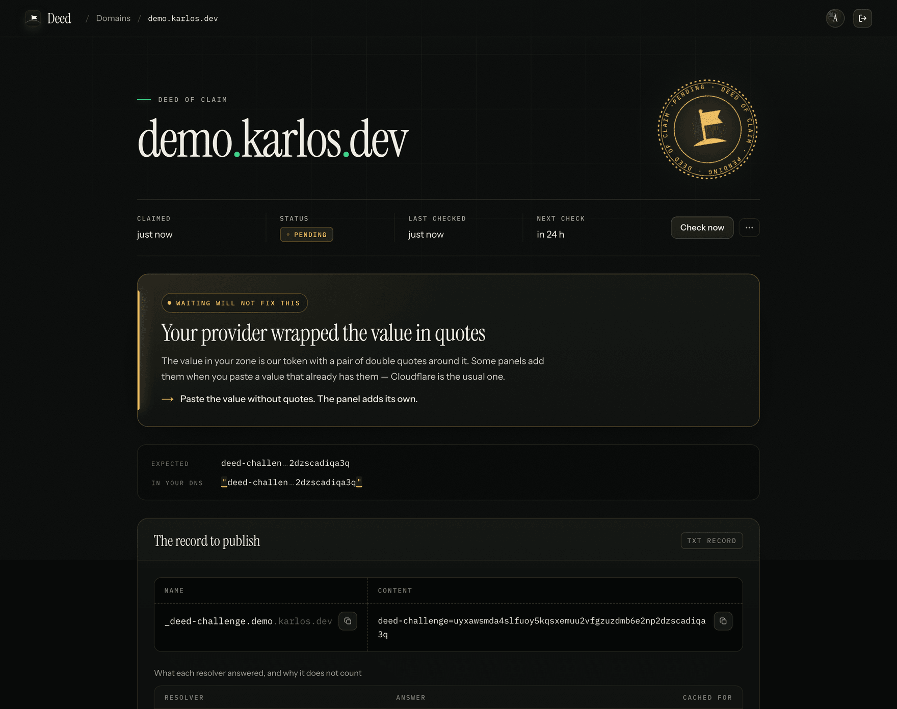
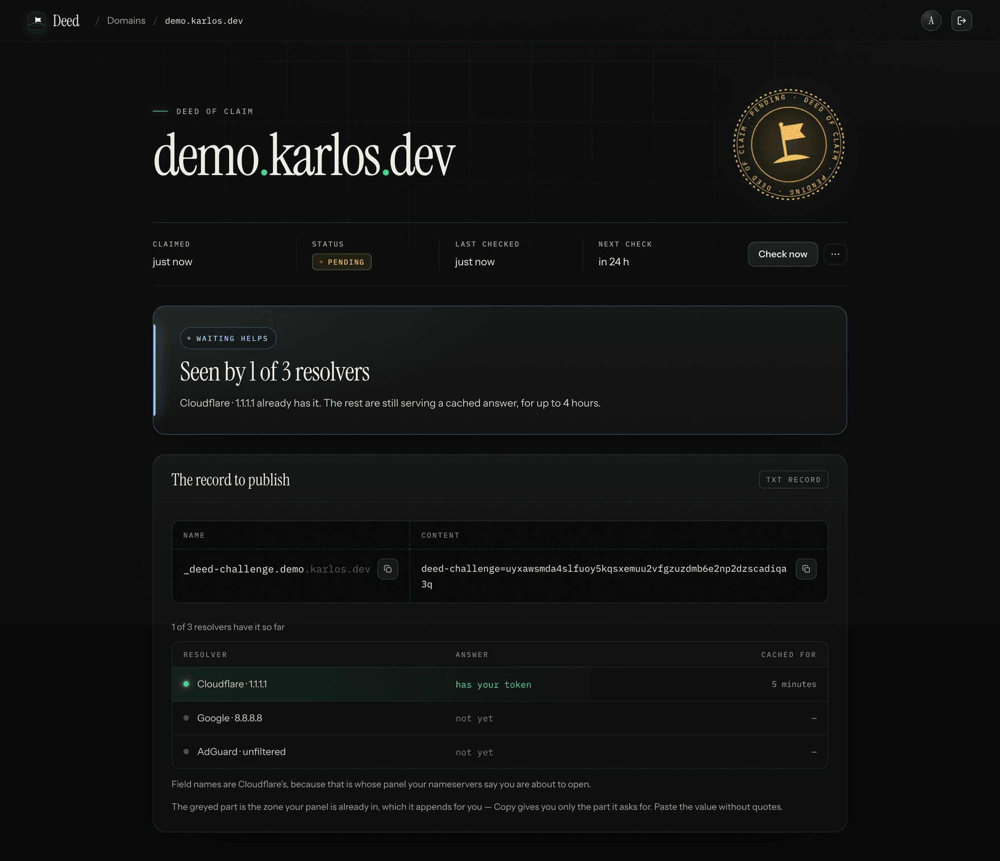
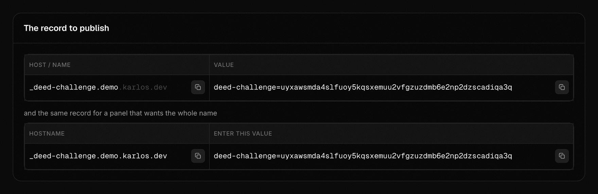
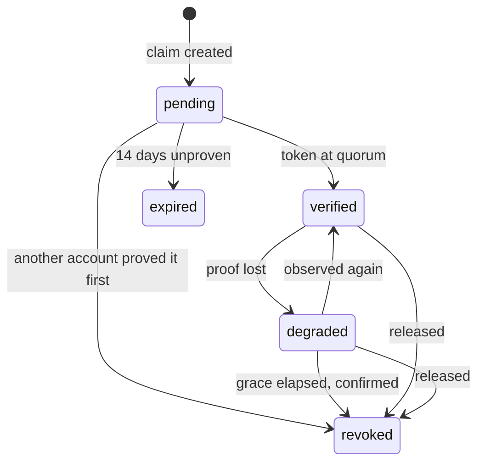

<p align="center">
  
</p>

<h1 align="center">Deed</h1>

<p align="center">
  <strong>Prove you own a domain — and see exactly why when you cannot.</strong>
</p>

<p align="center">
  <a href="https://domains.karlos.dev"><b>Live app</b></a> ·
  <a href="docs/prd.md">Product spec</a> ·
  <a href="docs/state-model.md">State model</a> ·
  <a href="docs/decisions.md">Decision log</a>
</p>

<p align="center">
  
  
  
  
  
</p>

<p align="center">
  
</p>

---

Deed is an independent study in **domain-ownership verification** — the
"add this TXT record to your DNS" step that sits in front of TLS certificates,
SSO domain claiming, custom domains on a CDN and search-console access.

It is a small product with a narrow thesis: **the hard part of verifying a
domain is not the check, it is the wait.** Most products go silent at exactly
the moment the user is least able to help themselves, and show *Pending* for
two situations that could not be more different — "not yet", which waiting
cures, and "wrong", which waiting never will. Deed spends its whole budget on
that gap.

## What it does

You claim a domain and get one TXT record:

```
_deed-challenge.example.com.  TXT  "deed-challenge=<52 chars of base32>"
```

Then Deed reads it back from **three independent resolvers** — Cloudflare,
Google and AdGuard, over DNS-over-HTTPS — and tells you what it found. Not
*pending*: which resolver has it, what TTL it reported, and, when the value is
wrong, **which provider quirk mangled it and whether waiting will help.** It
keeps reading afterwards, because DNS is mutable and verification decays.

| | |
| --- | --- |
| **Pre-flight before the token exists** | As you type the domain, Deed reads the zone: does it resolve, whose panel are you about to open, is there a wildcard, is the host already a CNAME. Warnings arrive *before* the mistake. |
| **Instructions in your provider's words** | Cloudflare calls the fields *Name* and *Content*; Route 53 calls them *Record name* and *Value*. Deed uses whichever panel you are about to open. |
| **A resolver matrix, not a spinner** | Each resolver's answer, its TTL, and whether the record is arriving or receding. |
| **Diagnosis that names the cause** | Quotes added by the panel, the zone name appended twice, a truncated value, an invisible character, a wildcard answering in the record's place — each with a character-level diff and the fix. |
| **Verification that is watched, not stamped** | A background sweep keeps re-checking. A record that disappears degrades the claim, opens a seven-day grace window, and says what is at risk *before* anything is revoked. |
| **Recovery as a first-class action** | Rotate the token, release the domain, re-claim it — each with honest copy about what it does and does not undo. |

## A tour

<p align="center">
  
  <br /><sub><b>The list.</b> Each domain's mark takes the colour of its claim, so the state reads before the badge does.</sub>
</p>

<p align="center">
  
  <br /><sub><b>A diagnosis.</b> One resolver sees a wrong value, so the clock stops — even though another already has the right one. The diff marks exactly the two characters the panel added.</sub>
</p>

<p align="center">
  
  <br /><sub><b>Propagation.</b> Not a spinner: who already has it, who is still serving a cached answer, and for how long.</sub>
</p>

<p align="center">
  
  <br /><sub><b>The record.</b> The copyable host is exactly what the panel expects — relative or absolute — so <code>_x.example.com.example.com</code> cannot happen.</sub>
</p>

## Try it without owning a domain

Anything ending in **`.test`** runs against a simulated zone that you edit
yourself, from inside the app. `.test` is reserved by RFC 2606 and can never
resolve in real DNS, so a simulated verification can never be mistaken for a
real one.

The simulated zone is not a demo mode. It implements the same `DnsPort` as the
real resolvers, so it drives the same engine, the same reducer and the same
audit ledger — and each simulated resolver adopts a change after its own delay
(25s / 55s / 95s), so propagation, staleness and receding records are real
rather than staged.

Claim `acme.test`, then use the zone editor to reproduce any row of the failure
taxonomy: publish the value with quotes around it, append the zone name, delete
the record, add a wildcard, put a CNAME at the host, or make the whole zone
SERVFAIL. Each produces its own named diagnosis.

## The model, in a paragraph

A domain has one lifecycle — its ownership claim — and beneath it the DNS record
carrying the proof has a lifecycle of its own. The claim's state is derived from
the record's; the record's is derived from what resolvers answered, through a
precedence table where **a wrong value at one resolver outranks a correct
majority**. That ordering is the product's thesis made mechanical: the moment
there is evidence that waiting will not help, the clock stops. Verification
needs quorum; *keeping* it does not, so a single cache eviction cannot flap a
domain between states. And absence of evidence is never evidence of absence: if
our own lookup failed, nothing is concluded and no clock advances — which is
what stops an outage on our side from revoking working domains.



The full specification is [`docs/state-model.md`](docs/state-model.md). It is
normative: `packages/core` implements it, and where the two disagree the spec
wins.

<details>
<summary><b>The failure taxonomy</b> — every diagnosis answers <i>does waiting help?</i></summary>

| Cause | Waiting helps | The message leads with |
| --- | --- | --- |
| `not_found` | yes | how long it usually takes at their provider |
| `partially_propagated` | yes | which resolvers already see it |
| `stale_token` | yes | a rotated value is still cached; it will clear |
| `quoted_value` | **no** | the provider added quotes |
| `appended_apex` | **no** | the provider appended the zone name |
| `whitespace` | **no** | an invisible character survived the paste |
| `truncated` | **no** | the panel has a length limit; how to split |
| `wrong_token` | **no** | this token belongs to a different claim |
| `wildcard_shadow` | **no** | the record is missing; a wildcard answers in its place |
| `cname_at_host` | **no** | a CNAME here prevents the TXT from resolving |
| `domain_unregistered` | **no** | the domain itself does not resolve |
| `unknown_value` | **no** | no known quirk explains it; here is the diff |
| `servfail` / `dnssec` | maybe | the zone is failing to answer, not us |

</details>

## How it is built

```
apps/web          Next.js (App Router) — UI, server actions and route handlers
packages/core     state machine, diagnosis, diff, name parsing — zero I/O
packages/dns      the DnsPort; DoH and sandbox adapters behind one contract suite
packages/db       Supabase clients, schema types, migrations
packages/ui       the design system — tokens, components, motion
```

A few properties worth calling out, because each is enforced rather than
asserted:

- **`packages/core` has no I/O.** ESLint forbids `node:*`, `fetch`, `process`
  and the browser globals inside it, and bans `Date.now()` outright — `now`
  arrives as a parameter, which is what lets a seven-day grace window be tested
  in microseconds.
- **Adding a state breaks the build.** States are discriminated unions, and a
  test grafts an extra variant onto a copy of the source and asserts that `tsc`
  refuses it at every site that switches over the union.
- **The precedence table is enumerated, not sampled** — all 559 combinations of
  resolver answers — and the model's invariants run as property tests.
- **Two invariants live in Postgres**, because a pure function cannot hold
  them. "At most one live claim per name" is a partial unique index;
  "transitions for one domain are serialized" is `apply_transition()`, which
  takes a per-domain lock, commits the state change and its audit events in one
  transaction, and refuses a writer whose read is stale.
- **Row-level security is tested against a real Postgres**, never a mock —
  including the half that says the owner must still be able to act, because a
  policy that denies everyone passes every isolation check and ships a broken
  product.
- **Verification keeps happening while nobody is watching.** `pg_cron` posts
  to `/api/sweep` every 30 seconds with a secret it reads from Supabase Vault,
  and a cadence table backs off as a claim settles.
- **The secret key cannot ship to the browser.** A post-build scan fails the
  build if the service key's pattern reaches any client chunk.
- **Every acceptance scenario has a test of the same name.** The delivery plan's
  45 `WHEN` / `THEN` scenarios are checked by `pnpm scenarios`, which fails if
  one has no matching test — the cheapest guardrail there is against specs
  quietly becoming fiction.

**Stack:** TypeScript · Next.js 16 · React 19 · Supabase (Postgres, Auth,
`pg_cron`, `pg_net`, Vault) · Vercel · pnpm + Turborepo · Vitest · happy-dom.

## Running it

```bash
pnpm install
pnpm --filter @deed/web dev
```

You need `apps/web/.env.local`; [`apps/web/.env.example`](apps/web/.env.example)
lists the variables and which of them are secret. The `/design` route renders
every state the product can draw, with no sign-in, in development.

```bash
pnpm test        # every package — the db suite starts a Postgres container
pnpm scenarios   # every scenario in the delivery plan has a test of that name
pnpm lint
pnpm typecheck
```

Two scripts refresh vendored data, and both commit their output so the diff is
readable:

```bash
node scripts/capture-doh-fixtures.mjs        # real resolver responses, for the contract suite
node scripts/capture-public-suffix-list.mjs  # the Public Suffix List
```

## What is deliberately not here

Email sending setup — DKIM, SPF, a return-path MX — is the obvious next thing to
build, and it is out of scope. Ownership is the whole problem; sending
configuration is *configuration*, not *proof*, and a domain does not stop being
yours when your SPF is wrong. A second record set would flow through the same
record lifecycle, the same resolver matrix and the same diagnosis engine without
adding one new idea. The effort went into pre-flight diagnosis, the resolver
matrix, rotation and degradation instead.

The seam is real and specified: the state machine is parameterised over the
record set, so a capability would be a new record spec fed to existing
machinery. What is out of scope is building a second one, not being able to.

Also out: registrar API integration (it would remove the very failure modes this
product exists to handle), teams and billing, DMARC/BIMI advisory, and bulk
import. The reasoning for each is in [`docs/prd.md`](docs/prd.md) §5.

## Honest limits

- **Supabase pauses free projects after about a week of low activity.** The
  sweep writes a real row every run to keep the database genuinely active, but
  this is an accepted free-tier constraint, not a solved problem. If the live
  link looks dead, that is probably why.
- **DoH cannot query a specific authoritative nameserver,** so the matrix shows
  three independent recursive caches rather than an authoritative row.
- **The third resolver is AdGuard's unfiltered endpoint, not Quad9.** Quad9
  requires HTTP/2, which Node's `fetch` does not speak. The reasoning, and why
  the *unfiltered* endpoint specifically, is [D15](docs/decisions.md).
- **No wide end-to-end suite.** What is deliberately not tested, and why, is
  [D12](docs/decisions.md).

## The real path is proven, not only the sandbox

`demo.karlos.dev` was claimed through the app and its TXT record published in
the real zone; the sweep found it at Cloudflare and Google, reached quorum, and
moved the claim to `verified`, with the ledger recording each step and the
evidence behind it:

```
04:31:00.6  state_changed   sweep    record: unchecked → absent
04:45:00.4  state_changed   sweep    record: absent → verified
04:45:00.4  state_changed   sweep    claim:  pending → verified
04:45:45.3  check_completed system   → verified          (lazy revalidation on read)
```

<details>
<summary><b>Deploying your own</b></summary>

The app is a Next.js project inside a pnpm workspace, so the Vercel project's
**root directory must be `apps/web`**.

**Environment variables** are listed in
[`apps/web/.env.example`](apps/web/.env.example). `SUPABASE_SECRET_KEY` is the
Supabase project's secret API key and must never carry a `NEXT_PUBLIC_` prefix —
the post-build scan fails the build if it ever reaches a client chunk.
`NEXT_PUBLIC_*` variables must be stored as Vercel *Config*, never *Secret* —
the Secret type withholds them from the very bundle the prefix exists to reach
([D16](docs/decisions.md)).

`GET /api/health` reports which variables are present — never a value — and
whether Postgres answers. `NEXT_PUBLIC_*` variables are inlined at build time,
so setting one after a deploy does nothing until you redeploy; that is the
failure this endpoint exists to name out loud.

**The custom domain.** Add it to the Vercel project, then create the record
Vercel asks for — normally a `CNAME` to `cname.vercel-dns.com.` — **where the
zone actually lives**, which is not always where the domain appears to be
managed. `karlos.dev` is edited from Squarespace's panel but answers from Google
Cloud DNS, because domains migrated from Google Domains kept the Google-hosted
nameservers. Check the `NS` first, then find the panel that drives *those*
servers.

**Sign-in** takes two callback URLs, and they are not the same one:

| Where | Value |
| --- | --- |
| GitHub OAuth app → *Authorization callback URL* | `https://<ref>.supabase.co/auth/v1/callback` |
| Supabase → Authentication → URL Configuration → *Site URL* | `https://<your domain>` |
| Supabase → *Redirect URLs* | `https://<your domain>/auth/callback` |

GitHub redirects to **Supabase**, and Supabase redirects to **the app**.
Pointing the OAuth app at the app directly is the usual first mistake. Name the
OAuth app after the product, too: GitHub's consent screen says "to continue to"
whatever it is called, on the first screen of a product whose entire subject is
proving identity (D9). GitHub is the only provider ([D22](docs/decisions.md)).

**The sweep.** Store the shared secret in Supabase Vault, using the same value
set as `SWEEP_SECRET` in the deployment:

```sql
select vault.create_secret('<the secret>', 'sweep_secret',
                           'Bearer token pg_cron presents to /api/sweep');
```

Then apply
[`packages/db/migrations/0003_sweep_schedule.sql`](packages/db/migrations/0003_sweep_schedule.sql).
It reads the secret from Vault rather than carrying it inline, because
`cron.job.command` is plain text readable by anyone with database access — a
secret pasted into a scheduled job is a secret published to every future reader
of that table.

</details>

## The documents

Four, each with one job, best read in this order:

| Document | Answers |
| --- | --- |
| [prd.md](docs/prd.md) | What is this, for whom, and why does it matter? |
| [state-model.md](docs/state-model.md) | What states exist, and what moves between them? |
| [delivery-plan.md](docs/delivery-plan.md) | What gets built, in what order, and how do we know it works? |
| [decisions.md](docs/decisions.md) | Why is it this way and not the obvious alternative? |

The decision log is append-only — reversals are new entries that mark the old
one superseded — so it also reads as the history of the design: what was tried,
what was cut, and why.

---

<p align="center">
  <sub>Designed and built by <a href="https://github.com/karlos-silva">Karlos Silva</a> · <a href="LICENSE">MIT licensed</a>. Deed only ever reads your DNS; it never writes to it.</sub>
</p>
