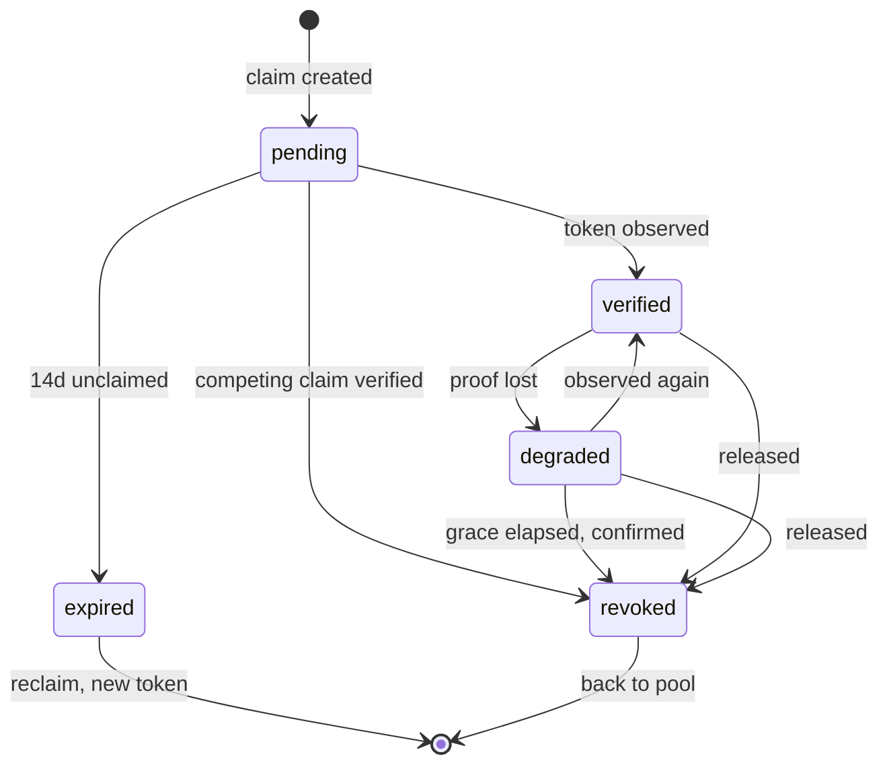
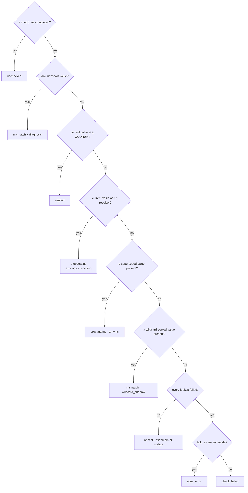

# State model

The normative specification of `packages/core`. Pure functions over plain data,
no I/O, no framework. Everything here is unit-testable without a network.

Related: [prd.md](./prd.md) · [decisions.md](./decisions.md)

---

## 1. One lifecycle, two levels

A domain has exactly one lifecycle: its ownership claim. Beneath it, the DNS
record carrying the proof has a lifecycle of its own. The claim's state is
derived from the record's; the record's is derived from what resolvers answered.

There is no second track. Per PRD §4, capabilities that ownership might unlock —
email sending, TLS issuance, SSO domain claiming — are out of scope. Each would
be a new record spec fed to this same machinery, not a new lifecycle.

```ts
type Domain = {
  id: DomainId
  ownerId: UserId
  name: string                       // punycode, lowercased, no trailing dot
  isSandbox: boolean
  ownership: OwnershipState
  record: RecordState                // latest view of the proof record (§3)
  supersession: Supersession | null  // set by rotation, honoured until its bound (§3)
  lastCheckedAt: Timestamp | null    // freshness — first-class and user-visible (D5)
  nextCheckAt: Timestamp             // what the sweep reads; set from the cadence (§5)
  createdAt: Timestamp
}

type Supersession = {
  previousToken: Token
  rotatedAt: Timestamp
  honourUntil: Timestamp  // rotatedAt + max(observed TTL at rotation, SUPERSEDE_FLOOR)
}
```

`record` and `supersession` live on the domain because the derivations in §3
need the previous observation's outcome — `propagating.direction` and the
corrected-mistake copy both compare against what was seen before — and the
rotation bookkeeping has to survive between checks. `lastCheckedAt` is the
freshness D5 promises to show.

## 2. Ownership lifecycle




```ts
type OwnershipState =
  | { status: 'pending';  token: Token; claimedAt: Timestamp; expiresAt: Timestamp }
  | { status: 'verified'; token: Token; verifiedAt: Timestamp }
  | { status: 'degraded'; token: Token; verifiedAt: Timestamp
                        ; degradedAt: Timestamp; revokesAt: Timestamp
                        ; cause: DegradedCause }
  | { status: 'expired';  claimedAt: Timestamp }
  | { status: 'revoked';  reason: 'grace_expired' | 'released_by_owner' | 'claimed_by_other' }
```

`degraded` carries the cause. "Your TXT record was deleted" and "your provider
now returns a different token" need different copy and different urgency, and
the state must carry enough to produce either.

`claimed_by_other` exists because pending is deliberately not exclusive
(PRD §8): the moment one claim verifies, every competing pending claim on the
name is revoked with an explanation — D6's "invalidated" made mechanical. It is
the one revocation that does not return the name to the pool, because the name
is now held.

### From record to claim

The claim's state is a function of the record's, and the function is this
table — evaluated by `reduce` after the record status is derived (§3):

| Claim | Record observation | Next claim | Why |
| --- | --- | --- | --- |
| `pending` | `verified` | `verified` | proof at quorum; competing pendings revoked |
| `pending` | anything else | `pending` | detail is shown; expiry is time-based at 14d |
| `verified` | `verified` | `verified` | freshness advances |
| `verified` | `propagating` | `verified` | hysteresis — see below |
| `verified` | `absent` | `degraded` · `record_missing` | the proof is gone everywhere |
| `verified` | `mismatch` | `degraded` · its cause | positive evidence of a wrong value |
| `verified` | `zone_error` | `degraded` · `zone_failing` | their zone stopped answering; they must be told |
| `verified` | `check_failed` | `verified` | we could not look; we conclude nothing (invariant 6) |
| `degraded` | `verified` | `verified` | recovery, free (invariant 4) |
| `degraded` | `propagating` | `degraded` | progress is shown; the window does not move |
| `degraded` | `absent` / `mismatch` / `zone_error` | `degraded` | window unchanged; cause updated if it changed |
| `degraded` | `check_failed` | `degraded` | no conclusion; revocation is deferred (below) |

`pending → revoked · claimed_by_other` is the one transition driven by
*another* claim's observation — it fires at the moment that claim verifies, so
it cannot appear in a table keyed on this claim's own record.

**Degradation needs conclusive evidence; losing one cache is not loss.** A
verified claim survives `propagating` in either direction — quorum is the bar
for *gaining* verification, not for keeping it. The window starts only when no
resolver holds the proof at all, or when a resolver holds positive evidence of
a wrong value. Verification and degradation are deliberately asymmetric so a
single cache eviction cannot flap a domain between states.

**Rotation does not degrade.** A verified claim whose record shows only the
superseded value is `propagating` (§3), which this table keeps `verified`. If
the new token is never published, supersession expires, the record becomes
`mismatch`, and degradation follows — with the usual 7-day window to finish
the job.

**Revocation requires a conclusive check, not just a date.** `degraded →
revoked` fires on the first conclusive observation at or after `revokesAt`
that still finds no proof. Elapsed time plus a week of our own failed lookups
is our outage, not their abandonment — a claim is never revoked on
`check_failed` evidence (invariant 6). `pending → expired` stays purely
time-based: expiring an unproven claim takes nothing away.

## 3. Record lifecycle

The lifecycle of the DNS record carrying the proof. Kept as its own vocabulary
rather than folded into the claim, because any future capability's records run
through it unchanged — one renderer, one set of tests.

```ts
type RecordState =
  | { status: 'unchecked' }
  | { status: 'absent';      kind: 'nxdomain' | 'nodata'; cname?: string }
  | { status: 'propagating'; direction: 'arriving' | 'receding'
                           ; seenBy: ResolverId[]      // hold the current value
                           ; staleAt: ResolverId[]     // hold a superseded value of ours
                           ; ttl: TtlObservation }
  | { status: 'mismatch';    observed: ObservedValue[]; cause: MismatchCause }
  | { status: 'verified';    seenBy: ResolverId[]; ttl: TtlObservation }
  | { status: 'zone_error';  errors: ResolverError[] }   // their DNS is failing
  | { status: 'check_failed'; errors: ResolverError[] }  // our lookup failed
```

Five of these exist because collapsing them produces a message that is wrong,
not merely vague:

- **`unchecked`** — no check has completed yet. Rendering `absent` before the
  first lookup tells the user their record is missing when we have not looked.
  There is no honest way to draw that state without its own case.
- **`absent.kind`** — `nxdomain` means the name does not exist, which is normal
  before the record is added. `nodata` means the name exists but holds no TXT,
  which usually means a CNAME or a typo'd host, and warrants a different hint.
  When a CNAME was observed at the host it is carried on the state, because a
  CNAME here is *why* the TXT cannot resolve (PRD §7 `cname_at_host`).
- **`propagating.direction`** — "seen by 2 of 3" means *almost there* when the
  record is arriving and *this is disappearing* when it is receding. Identical
  evidence, opposite copy. Direction is not derivable from one observation; it
  comes from the previous state, which is why `reduce` takes both.
- **`zone_error` vs `check_failed`** — SERVFAIL, REFUSED, or a DNSSEC validation
  failure is a real problem in the user's zone and they must be told. A timeout,
  a network fault, or a DoH provider throttling us is *our* failure, and dressing
  it up as a DNS problem sends the user to debug a zone that is fine.

### Diagnosis causes

The cause unions referenced above, defined once:

```ts
type MismatchCause =
  | 'quoted_value'    // provider wrapped the value in quotes
  | 'appended_apex'   // provider appended the zone name
  | 'whitespace'      // an invisible character survived the paste
  | 'truncated'       // the panel cut the value short
  | 'wrong_token'     // a well-formed token from a different claim
  | 'wildcard_shadow' // only a wildcard answers; the record itself is missing
  | 'unknown_value'   // present, wrong, and no known quirk explains it

type DegradedCause = MismatchCause | 'record_missing' | 'zone_failing'
```

The PRD §7 taxonomy is user-facing and wider than `MismatchCause`, because not
every row is a mismatch. The mapping, so the "every row reaches its named
cause" obligation in §7 stays testable:

| PRD §7 row | Lives at |
| --- | --- |
| `not_found` | record `absent` |
| `partially_propagated` | record `propagating` |
| `quoted_value` `appended_apex` `whitespace` `truncated` `wrong_token` `unknown_value` | `mismatch.cause` |
| `stale_token` | record `propagating`, via supersession (below) |
| `wildcard_shadow` | `mismatch.cause`, only when the wildcard alone answers (below) |
| `cname_at_host` | record `absent` carrying the observed CNAME; also a pre-flight warning |
| `domain_unregistered` | a pre-flight refusal — at check time it is indistinguishable from `absent` |
| `servfail` / `dnssec` | record `zone_error`; on a verified claim, `degraded.cause = 'zone_failing'` |

### Superseded values, or why rotation does not read as breakage

When the user rotates a token, the previous value stays in resolver caches for
up to its TTL. It is non-matching, so a naive rule
calls it `mismatch` and tells the user waiting will not help, when waiting is
precisely what fixes it.

So the comparison set is `{current} ∪ {recently superseded}`. A resolver holding
a superseded value lands in `staleAt` and yields `propagating`, not `mismatch`.

Two constraints on that:

1. **A superseded value never counts toward quorum.** It prevents a false
   `mismatch`; it can never produce a `verified`. Only the current value proves
   anything.
2. **Supersession expires.** A previous value is honoured for
   `max(observed TTL, SUPERSEDE_FLOOR)` — 24 hours, §5 — after rotation, then
   becomes an ordinary unknown value. Without a bound, a rotated — possibly
   leaked — token would stay acceptable forever, which defeats the entire
   point of offering rotation.

### Derivation, in strict precedence order

Every check queries two names: the challenge host, and a **control probe** — a
random unguessable *sibling* label under the claimed name (for a claim on
`updates.acme.com`, `<random>.updates.acme.com`; a sibling, because DNS's
closest-encloser rule means a wildcard one level up may not even match the
challenge host). Any value the probe returns is being served by a wildcard.

Each observed value is classified before any rule runs, first match wins:

1. **current** — equals the expected token. This is proof regardless of
   wildcards: the token is high-entropy and scoped, so publishing it
   *anywhere* in the zone required control of the zone. A wildcard cannot
   fabricate it.
2. **superseded** — equals a rotated-out token still inside its bound (above).
3. **wildcard-served** — equals a value the control probe returned. Explained,
   like superseded: it suppresses `mismatch` and never counts toward quorum.
4. **unknown** — none of the above.

Then, given every resolver's answer for the record, evaluate top to bottom and
stop at the first match:

| # | Condition | Result |
| --- | --- | --- |
| 0 | no check has completed | `unchecked` |
| 1 | any resolver holds an **unknown** value | `mismatch` + diagnosis |
| 2 | resolvers holding the **current** value ≥ `QUORUM` | `verified` |
| 3 | resolvers holding the **current** value ≥ 1 | `propagating` |
| 4 | some hold a **superseded** value, none the current one | `propagating` / `arriving` |
| 5 | some hold a **wildcard-served** value — the wildcard is all that answers | `mismatch` / `wildcard_shadow` |
| 6 | all failed, and the failures are zone-side | `zone_error` |
| 7 | all failed, and the failures are ours | `check_failed` |
| 8 | otherwise | `absent` |

The same rules as a tree. The table is normative; this is for reading.



**Rule 1 outranks rules 2–3 deliberately.** A wrong value at *one* resolver
fails the record even if two others already match. This is principle #1 from
the PRD made mechanical: the moment we have evidence that waiting will not
help, we stop the clock. Ranking `verified` higher would let a
correct-but-stale majority mask a value the user just broke.

**The same evidence has a kinder reading, and prior state tells them apart.**
"Current value gaining resolvers, one stale wrong value receding" is what a
*corrected* mistake looks like from the outside — the mirror image of "user
just broke it". The status stays `mismatch` either way, because an unknown
value must surface; but when the previous observation shows the same offending
value at a shrinking set of resolvers while the current token spreads, the
copy hedges: the fix is arriving, and the stale answer clears within its TTL.
The same prior-state technique as `propagating.direction`, applied to guidance
instead of status.

**Wildcards inform diagnosis; they do not veto proof.** Legitimate wildcard
TXT records exist — publishing `* IN TXT "v=spf1 -all"` is a recommended
anti-spoofing practice — and an explicit record overrides a wildcard in DNS,
so a blanket "probe answered → fail" would permanently fail honest zones.
Instead, wildcard-served values are explained away by classification, and
`wildcard_shadow` is diagnosed only when the wildcard is the *only* thing
answering — which means the record itself does not exist yet, and the copy
says exactly that: create the record; the wildcard does not block it, and
waiting will not create it for you. The pathological zone whose wildcard value
*is* the current token verifies, correctly: putting the token there required
zone control, which is the thing being proven.

**TTL is a set, not a scalar.** Every resolver reports its own remaining TTL,
counting down independently in each cache. `TtlObservation` keeps the per-resolver
values and exposes the authoritative maximum, which is the only one that predicts
how long a stale answer can persist.

### Comparison rules

Before comparing an observed value to the expected one:

1. **Join multi-string TXT records.** DNS transmits TXT values longer than 255
   bytes as several character-strings that concatenate with no separator. A
   32-byte ownership token never reaches that length, so this is unreachable
   through the product as scoped — it is implemented and tested anyway, because
   the resolver layer is a general TXT reader and a wrong answer here would be a
   silent one.
2. **Match any RR, not all.** A host may hold several TXT records — during
   rotation it legitimately holds two of ours. Ours needs to be present among
   them, not alone.
3. Compare byte-exact after joining. Do not trim, unquote, or normalise —
   those deviations are precisely what the diagnosis layer must observe and name.

## 4. Invariants

Properties that must hold after every transition. These become property-based
tests, not prose.

1. **At most one live claim per domain.** `verified` and `degraded` are both
   exclusive; `pending` is not. Any number of users may hold `pending` claims on
   the same name (PRD §8).
2. **Degradation preserves exclusivity.** A `degraded` holder keeps the domain
   for the full grace window. A competing `pending` claim cannot be promoted
   while a `degraded` claim is live — you do not lose your domain to a squatter
   because of a DNS migration.
3. **`mismatch` never presents waiting as the cure.** On a pending claim it
   stops the clock: no countdown, no propagation estimate — a wrong value is
   not a delay. On a *verified* claim the same evidence does start the 7-day
   grace window (§2): degradation is the owner's time to fix the zone, and a
   changed value needs fixing exactly as a deleted one does. The copy leads
   with the fix, never the deadline.
4. **Recovery is free.** `degraded → verified` resets the window completely and
   records no penalty. The user fixed it; that is the outcome we wanted.
5. **Every transition emits exactly one audit event.** The log is the product
   surface for "show your work" — a transition that leaves no trace is a bug.
6. **Absence of evidence is never evidence of absence.** A `check_failed`
   observation changes nothing: it cannot start a grace window, cannot demote a
   `verified` record, and cannot advance any clock. If we could not look, we do
   not conclude. This is the invariant that keeps a DoH outage on our side from
   revoking working domains — and it extends to revocation itself: a `degraded`
   claim past its deadline is not revoked until a conclusive observation
   confirms the proof is still gone (§2).
7. **Superseded values never reach quorum.** They suppress a false `mismatch`
   and nothing else (§3).
8. **Transitions for one domain are serialized.** `reduce` is pure and safe to
   run concurrently; *persisting* its result is not. A background sweep and a
   user's *Check now* firing together would both read the same prior state and
   both write a transition — two audit events for one change, breaking invariant
   5, and a lost update if the second overwrites the first. Writes take a
   per-domain lock, and the state change and its audit event commit in one
   transaction. This is the one invariant the pure core cannot hold on its own.
9. **State is a pure function of observations.** `reduce(state, observation)`
   has no clock of its own; `now` is an explicit parameter. This is what makes
   day-long windows testable in microseconds.

## 5. Timing

```ts
const QUORUM             = 2            // of 3 resolvers
const CLAIM_TTL          = days(14)     // pending → expired
const OWNERSHIP_GRACE    = days(7)      // degraded → revoked
const SUPERSEDE_FLOOR    = hours(24)    // rotated tokens honoured max(TTL, this)
const CHECK_NOW_COOLDOWN = seconds(30)  // per domain
const USER_LOOKUP_BUDGET = perHour(60)  // user-triggered checks and pre-flights
const CLAIM_ATTEMPTS     = perHour(20)  // per user; the standing cap is 25 (D1)
```

**Why the grace window is generous.** The two failure modes are not equally bad.
Revoking too early returns a domain to the pool while its rightful owner is
mid-migration, and a squatter can take it. Revoking too late makes a genuine new
owner wait a few days. False revocation is far worse than false retention, so the
window is measured in days, not hours.

**Rate limits are product surface, not infrastructure trivia.** The *Check
now* refusal shows the cooldown remaining (S4). The pre-flight is debounced:
it fires when the input parses as a claimable name and the typing pauses —
never per keystroke — and at most once per minute per distinct name, because
every pre-flight is a real lookup against shared public resolvers.

### Check cadence — backoff, not a fixed interval

The prototype checks every 60s forever. Real DNS does not reward that, and it
burns rate limit on shared DoH endpoints.

| Since last state change | Interval |
| --- | --- |
| < 5 min | 30 s |
| < 1 h | 2 min |
| < 24 h | 15 min |
| verified and steady | 6 h |
| `degraded` | 5 min |

Degraded checks *accelerate*: that is the window where the user is actively
fixing something and wants immediate feedback. "Check now" is always available,
rate-limited per domain, and never lies about what it found — including
returning the same answer as a moment ago.

## 6. The reducer

```ts
function reduce(
  state: Domain,
  observation: Observation,   // one completed multi-resolver check
  now: Timestamp,
): { next: Domain; events: AuditEvent[] }

type Observation = {
  startedAt: Timestamp
  answers: ResolverAnswer[]   // the challenge host — one entry per resolver
  probe: ResolverAnswer[]     // the wildcard control probe, same resolvers (§3)
}

type ResolverAnswer =
  | { resolver: ResolverId; outcome: 'answered'
    ; values: string[]        // one per RR, multi-string TXT already joined
    ; ttl: number; cname?: string }
  | { resolver: ResolverId; outcome: 'nxdomain' | 'nodata' }
  | { resolver: ResolverId; outcome: 'zone_error';   detail: 'servfail' | 'refused' | 'dnssec' }
  | { resolver: ResolverId; outcome: 'check_failed'; detail: 'timeout' | 'network' | 'throttled' }

type AuditEvent = {
  domainId: DomainId
  at: Timestamp
  kind: 'claim_created' | 'check_completed' | 'state_changed'
      | 'token_rotated' | 'released' | 'reclaimed'
  actor: 'user' | 'sweep' | 'system'
  from?: string               // prior claim or record status, on state_changed
  to?: string
  evidence?: Observation      // the completed check behind a verdict
}
```

`AuditEvent` is deliberately loose — the exact field set is `packages/core`'s
to refine. What is normative: a `state_changed` event always carries the
evidence that produced it (S6 renders it), events are append-only and
immutable, and `check_completed` is emitted even when nothing changed, because
"we looked and it held" is the product's freshness claim.

Total, pure, and exhaustive over the union. No `default:` branch anywhere —
adding a status must break the build at every site that needs updating. That is
the entire reason these are discriminated unions rather than string enums.

Time-based transitions are evaluated inside `reduce` from `now`, never by a
separate scheduler — with one deliberate asymmetry. `pending → expired` fires
on time alone: expiring an unproven claim takes nothing away. `degraded →
revoked` requires the elapsed deadline *and* a conclusive observation that the
proof is still gone (§2, invariant 6). A state read at time T is correct at
time T even if no check has run since — the sweep in D5 makes transitions
*timely*, but correctness never depends on it having run.

## 7. Test obligations

- Every row of the PRD §7 taxonomy reaches its named cause at the layer the
  mapping in §3 assigns it, from a real fixture captured from a real resolver.
- Every invariant in §4 as a property test over generated observation sequences.
- The precedence table in §3 is exhaustive: every ordering of resolver answers
  lands in exactly one status.
- Multi-string TXT joining, against a synthetic >255-byte value (see §3).
- A host answered only by a wildcard produces `wildcard_shadow`, never
  `verified` — and a zone with a wildcard TXT *and* a correct explicit record
  at quorum verifies (§3).
- The record→claim table in §2, exhaustively: every (claim status, record
  status) pair lands where the table says.
- The 14-day claim expiry and 7-day grace windows, driven by injected `now`,
  running in milliseconds.
- A `degraded` claim past its deadline with only `check_failed` observations
  is not revoked; the first conclusive absent observation after the deadline
  revokes it.
- Rotation: the superseded value yields `propagating`, never `mismatch`, and
  never counts toward quorum — and stops being honoured once its bound expires.
- A `check_failed` sequence of any length leaves state and every clock untouched.
- `receding` is reported when resolver coverage drops from a verified record,
  and `arriving` when it climbs from absent.
